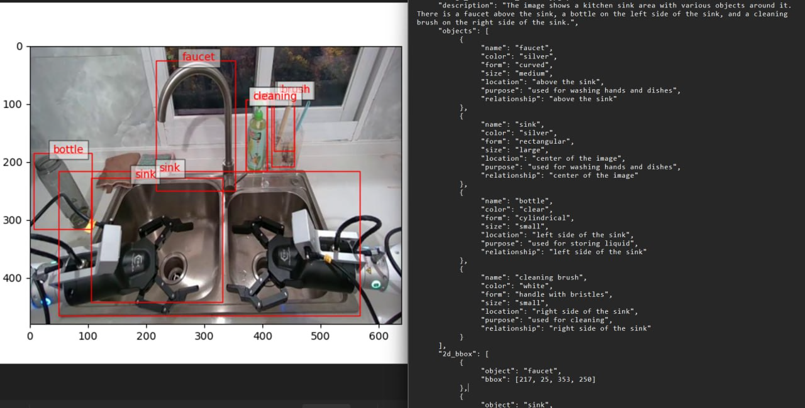
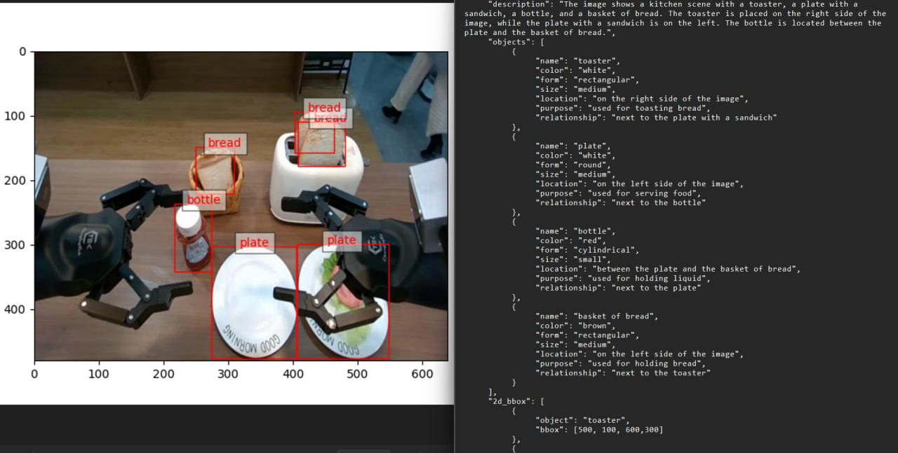

# Пайплайн авторазметки изображений в формат json
## Решаемая проблема:
- На изображение может быть все что угодно - от пакета, до микроволновки. Нужно уметь детектировать предметы разных необычных классов  
- Объекты на изображение нужно описать в формате JSON - их цвет, размер, уникальные свойства, предназначение, позицию  
- Подзадачи - определить классы объектов на изображении. Задетектировать их
- Проект сделан в рамках тестового задания SberRobotics: [ссылка](https://docs.google.com/document/d/1H8nDUcgmoqPhW_V4uehYiPc3OFNGwrHIQRu1_G0pRgc/edit?usp=sharing)

## Результаты:
#### Пример 1

#### Пример 2


### Пайплайн из папки с изображениями создает четыре папки:
- Описание объектов и изображения в JSON стиле
- Размеченные картинки с bounding boxes и классами объектов
- Размеченные json с bounding boxes  и классами объектов
- Список найденных классов на изображении


## Как это работает. Шаги:
1. Генерация классов-кандидатов на изображении с помощью VLM (Qwen2). Список классов записывается в одноименный файл в папке `data/classes`. Этап можно пропустить, задав дефолтные классы
2. Поиск указанных классов на изображении через LangSAM (Segment-Anything + GroundingDINO). Формирование файлов с классами и bounding boxes в папке `marked_detections` и `marked_detections_pictures`  
3. Генерация json-описаний изображений, (включая уникальные свойства для всех предметов) с помощью VLM (Qwen2). Итоговые данные хранятся в папке `OUTPUT_JSON`.  

## Планы на развитие проекта:
- Некоторые объекты могут не попадать в файл или объединяться в группы в финальном JSON. А хотелось бы описывать каждый объект. Поэтому VLM будет запускаться столько раз, сколько обнаружено объектов в кадре (сейчас json полностью формируется одним запросом в VLM). Это сильно повысит качество разметки
- Планируется добавить few-shot в системные промпты
- Планируется увеличить универсальность для пользования на разных задачах. Проект создавался как решение тестового задания `авторазметка изображений для робота-манипулятора`. Хочется сделать инструмент удобным и для других задач, а не одной конкретной

## Установка:
1. `conda create -n "ENV_NAME" python=3.11` . Версия Python точно нужна не меньше чем 3.11
2. `conda activate ENV_NAME`
3. `pip install torch==2.4.1 torchvision==0.19.1 --extra-index-url https://download.pytorch.org/whl/cu124` В случае проблем с установкой, попробуйте без extra-index, просто версии библиотек
4. `pip install -U git+https://github.com/luca-medeiros/lang-segment-anything.git`
5. `pip install qwen-vl-utils pillow tqdm matplotlib transformers==4.51.3 accelerate`. Не обращать внимания на конфликты версий transformers 4.44 и 4.51. Возможно получится использовать другие версии transformers, особенно версии выше

 ## Запуск:
 1. Из директории проекта (в которой расположены `data, src, README.md ...`) нужно вызвать команду
    `python -m src.main`
 2. Введите значение количества параметров модели (2, 7, 32 или 72). `Модель на 2 млн парметров В НЕСКОЛЬКО РАЗ (!) хуже модели на 7 млн.` И наоборот, 7 млн показывает достаточно точный результат
 3. Введите имя папки для анализа. В качестве  примера указаны 2 директории - на 5 картинок (data/debug) и на 100 (data/test_data_1)
 4. Дождитесь окончания всех этапов

## ПРИМЕЧАНИЯ:
- ```!!! модель на 2 млн параметров ОЧЕНЬ слабая и неточная. Постарайтесь использовать хотя бы 7 млн параметров, и увидите кратный прирост качества```
- `!!!` Советую заглянуть в `data/marked_detections_pictures` - там можно `посмореть, как хорошо работает детекция объектов`. Находиться очень многое даже моделью на 2B параметров
- `!!!` Если детекция нашлась и есть на фото - не факт что она попадет в финальный json. VLM, особенно слабая (на 2B парамтеров), любит игнорировать объекты или объединять их в группу, например chair + chair = chairs
- В случае если модель не смогла сгенерировать валидный json (часто бывает у слабой модели) - итоговый файл записан не будет
- Дефолтные классы (содержатся в `config/prompt/user/default_humanoid_robot_classes.txt`) на 90% были получены, открыв каталог СберМегаМаркета, и взяв то, что может оказаться рядом с роботом
- Дефолтные классы заполняются только в случае, если на шаге 1 qwen не сгенерировала 3+ классов самостоятельно (2, 1, 0 классов)
- Произволидся валидация ответов VLM на формат вывода. Если не выход соответствует форме, в файл не записывается результат
- Производится фильтрация боксов по размеру. По умолчанию - BBox должен занимать хотя бы `0.5%` изображения 


## Структура проекта:
- main.py основной файл для взаимодействия и запуска
- data - хранит данные
- data/classes - хранит классы изображений из последнего запуска
- data/debug - хранит debug хранит картинки для проверки работы пайплайна
- data/OUTPUT_JSON - хранит ответы шага №3 последнего запуска
- data/marked_detections - хранит json с классами и bounding boxes шага 2
- data/marked_detections_pictures - хранит изображения с нарисованными bounding boxes и classes шага 2
- src/config - Промпты и константы
- src/core/description - Пайплайны описания изображений черещ qwen
- src/code/detection - пайплайны нахождения объектов через LangSAM
- models - репозиторий оберток над моделями. Например в models/qwen2 содержатся обертки над двумя промптами (для генерации классов и для генерации json)

## Дополнительно:
- Можно пропустить шаг 1, поменяв соответствующую часть кода в main.py на следующее:
```py
# Получение детекций и bounding_boxes изображений
model = LangSAMWrapper()
pipeline = DetectionPipeline(model, image_dataset=image_dataset, same_classes_on_all_images=False)
# Читаем сохраненные классы на изображениях
classes_of_folder = pipeline.get_classes_of_images()
# Сохраняем в json детекции
pipeline.run(classes=classes_of_folder)
print(f"Детекция объектов завершена и сохранена в папке {DETECTIONS_DIR}")
# Наносим bboxs and labels на изображения для подачи в VLM
pipeline.mark_pictures()
print(f"Разметка картинок завершена и сохранена в папке {DETECTIONS_PICTURES_DIR}")
```